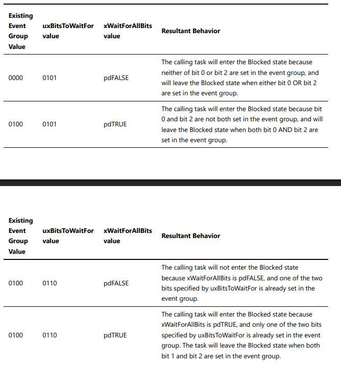

# Description

Sử dụng 2 task, 1 task mô phỏng thu dữ liệu từ cảm biến nhiệt độ, 1 task mô phỏng thu dữ liệu từ cảm biến độ ẩm.

Do xClearOnExit được set là pdTRUE nên phải cả 2 task cảm biến cùng set bit event thì task process data mới thoát được blocked state và đi vào thực thi chương trình.

# Table explain xWaitForAllBits

==> tạo các ví dụ giống như trong table minh họa